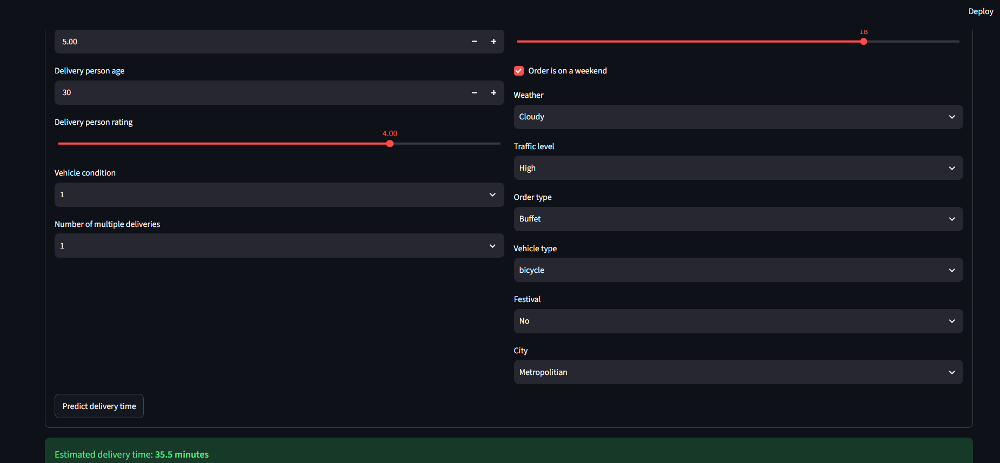
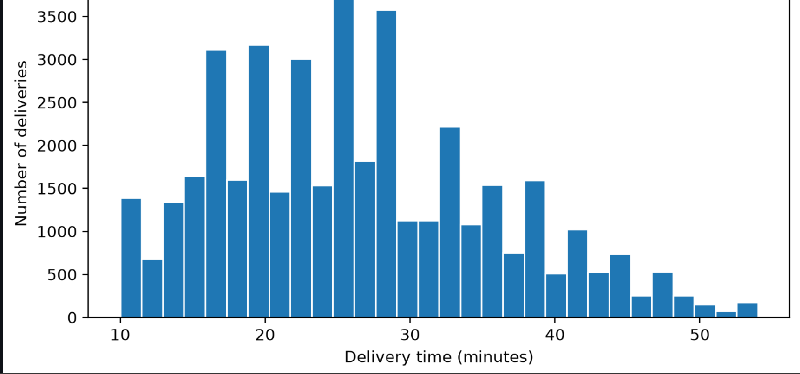
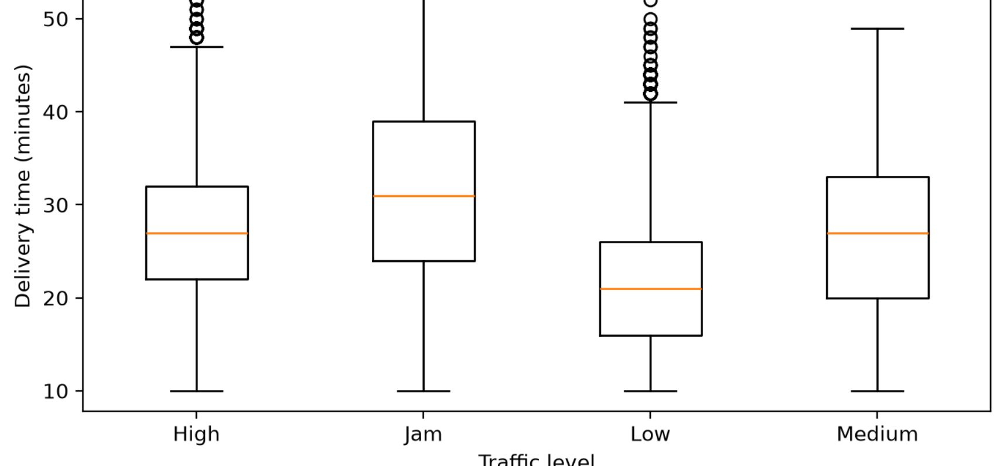
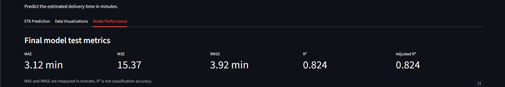
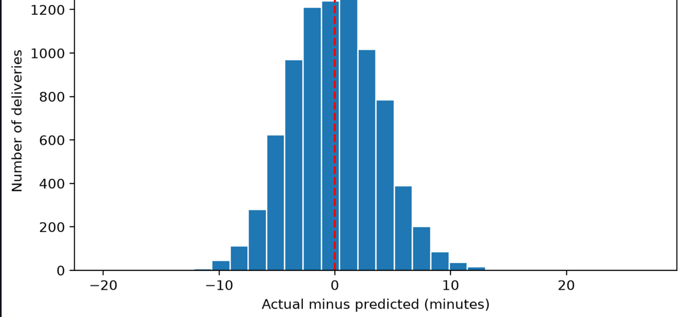

# DeliveryETA | Predictive Modeling of Food Delivery Time

## 1_ Project Overview

**DeliveryETA** is a Machine Learning project built to predict the **total food delivery time in minutes**.

The main business question is:

**How many minutes will this delivery take?**

This solution helps a delivery company to:

- provide customers with a realistic ETA;
- improve courier planning and assignment;
- understand which factors increase or reduce delivery time;
- identify risky situations that may lead to delays.

---

## 2_ Business Objective

The goal is to build a regression model able to predict:

- **Delivery_Time_min**

from operational and contextual information such as:

- rider age and rating;
- restaurant and customer coordinates;
- weather conditions;
- traffic density;
- type of order;
- type of vehicle;
- city;
- number of multiple deliveries;
- time-related information.

---

## 3_ Dataset Description

The dataset used in this project is **Food delivery.csv**.

It contains historical food delivery records with the following information:

- `ID`
- `Delivery_person_ID`
- `Delivery_person_Age`
- `Delivery_person_Ratings`
- `Restaurant_latitude`
- `Restaurant_longitude`
- `Delivery_location_latitude`
- `Delivery_location_longitude`
- `Order_Date`
- `Time_Orderd`
- `Time_Order_picked`
- `Weatherconditions`
- `Road_traffic_density`
- `Vehicle_condition`
- `Type_of_order`
- `Type_of_vehicle`
- `multiple_deliveries`
- `Festival`
- `City`
- `Time_taken(min)`

### Target Variable
- `Delivery_Time_min`

---

## 4_ Project Workflow

### Step 1 - Data Loading and Cleaning

The raw dataset was cleaned and transformed to make it usable for modeling.

Main cleaning operations:

- removed extra spaces from column names and text values;
- cleaned noisy text values such as:
  - `conditions Sunny` → `Sunny`
  - `(min) 24` → `24`
- converted columns to proper data types;
- handled missing values;
- removed duplicates;
- dropped unnecessary identifier columns;
- treated unrealistic values and outliers.

### Step 2 - EDA and Dependency Analysis

Exploratory Data Analysis was performed to understand the factors influencing delivery time.

This included:

- descriptive statistics for numerical variables;
- frequency analysis for categorical variables;
- visualization of the target variable distribution;
- analysis of the relationship between target and explanatory variables;
- correlation matrix;
- feature engineering.

### Step 3 - Data Transformation and Model Training

The prepared dataset was transformed and used to train several regression models.

Main operations:

- encoding categorical variables using `OneHotEncoder`;
- train/test split using 80% / 20%;
- scaling numerical features using `StandardScaler`;
- training and comparing multiple regression models.

### Step 4 - Optimization and Evaluation

The best model was tuned using hyperparameter optimization and evaluated using business-relevant metrics.

### Step 5 - Streamlit Application

A Streamlit application was created to allow a non-technical user to:

- enter delivery information;
- obtain a predicted ETA;
- visualize data insights;
- view model metrics and prediction quality.

---

## 5_ Missing Values Strategy

Missing values were handled using justified strategies:

### Numerical Columns
- `Delivery_person_Age`
- `Delivery_person_Ratings`
- `multiple_deliveries`

**Method used:** median imputation

**Why:**  
The median is robust to outliers and gives a realistic central value.

### Categorical Columns
- `Weatherconditions`
- `Road_traffic_density`
- `Festival`
- `City`

**Method used:** mode imputation

**Why:**  
The mode keeps the most frequent category and is appropriate for categorical variables.

### Time Column
- `Time_Orderd`

**Method used:** mode imputation

**Why:**  
The variable was treated as a categorical time value for imputation simplicity.

---

## 6_ Feature Engineering

To improve model performance, new features were created.

### Created Features

#### 1_ `Distance_km`
Calculated using the Haversine formula from:

- `Restaurant_latitude`
- `Restaurant_longitude`
- `Delivery_location_latitude`
- `Delivery_location_longitude`

**Why:**  
Distance is one of the strongest drivers of delivery time.

#### 2_ `Order_Hour`
Extracted from `Time_Orderd`.

**Why:**  
Delivery duration depends on the hour of the day.

#### 3_ `Is_Weekend`
Created from `Order_Date`.

**Why:**  
Weekends may affect traffic and demand patterns.

---

## 7_ Final Modeling Dataset

After feature engineering and column selection, the final model-ready dataset included:

- `Delivery_person_Age`
- `Delivery_person_Ratings`
- `Weatherconditions`
- `Road_traffic_density`
- `Vehicle_condition`
- `Type_of_order`
- `Type_of_vehicle`
- `multiple_deliveries`
- `Festival`
- `City`
- `Distance_km`
- `Order_Hour`
- `Is_Weekend`
- `Delivery_Time_min`

---

## 8_ Models Trained

The following regression models were trained and compared:

- Linear Regression
- SVR
- Random Forest Regressor
- Gradient Boosting Regressor

All models were trained on the same train/test split for fair comparison.

---

## 9_ Model Evaluation Metrics

The models were evaluated using:

- **MAE**: Mean Absolute Error
- **MSE**: Mean Squared Error
- **RMSE**: Root Mean Squared Error
- **R²**
- **Adjusted R²**

These are appropriate regression metrics because the target is continuous and measured in minutes.

---

## 10_ Initial Model Comparison

| Model | MAE | MSE | RMSE | R² |
|------|----:|----:|-----:|---:|
| Linear Regression | 4.82 | 37.00 | 6.08 | 0.58 |
| SVR | 3.78 | 23.42 | 4.84 | 0.73 |
| Random Forest | 3.18 | 16.25 | 4.03 | 0.81 |
| Gradient Boosting | 3.59 | 20.59 | 4.54 | 0.76 |

### Best Model
**Random Forest Regressor**

---

## 11_ Hyperparameter Optimization

The Random Forest model was tuned using GridSearchCV / RandomizedSearchCV.

### Best Parameters
- `n_estimators = 300`
- `max_depth = 15`
- `min_samples_split = 10`
- `min_samples_leaf = 1`
- `random_state = 42`

---

## 12_ Final Results

> Replace the values below with your final values if they changed after the final run.

### Final Test Metrics
- **MAE**: 3.18 minutes
- **RMSE**: 4.03 minutes
- **R²**: 0.82
- **Adjusted R²**: `0.8237`

### Business Interpretation
The final model makes an average prediction error of about:

**4 minutes**

This means:

> **On average, the model is off by about 4 minutes when predicting delivery time.**

This performance is acceptable for a practical ETA prediction system in food delivery.

---

## 13_ Key Insights from EDA

The variables most strongly linked to delivery time were:

- **Distance_km**  
  Longer distance increases delivery time.

- **Road_traffic_density**  
  Jam and high traffic conditions lead to longer delivery times.

- **Weatherconditions**  
  Bad weather such as fog, stormy, or sandstorm conditions tends to increase delivery time.

- **multiple_deliveries**  
  More deliveries assigned to the rider generally increase total delivery time.

- **Delivery_person_Ratings**  
  Better-rated riders tend to perform slightly faster.

---

## 14_ Project Structure

```bash
DeliveryETA/
├── app/
│   └── app.py
├── data/
│   ├── raw/
│   │   └── food-delivery.csv
|   ├── clean/
│   │   └── clean_data.csv
│   └── processed/
│       ├── model_ready_data.csv
│       └── test_predictions.csv
├── models/
│   ├── delivery_model.pkl
│   └── model_config.pkl
│   
├── notebooks/
│   ├── 01_cleaning.ipynb
│   ├── 02_eda.ipynb
│   ├── 03_modeling.ipynb
│   └── 04_optimization.ipynb
├── src/
│   ├── __init__.py
│   └── prediction.py
├── screenshots/
│   ├── prediction.png
│   ├── data_visualizations.png
│   └── model_performance.png
├── requirements.txt
├── Dockerfile
├── .dockerignore
└── README.md
```

---

## 15. Streamlit Application

The Streamlit application allows users to:

- enter delivery conditions manually;
- predict the estimated delivery time in minutes;
- view data visualizations;
- view model performance metrics;
- inspect actual vs predicted performance.

### Main App Sections
1. **ETA Prediction**
2. **Data Visualizations**
3. **Model Performance**

---

## 16. Installation

### Clone the Repository

```bash
git clone https://github.com/hamzalafsioui/DeliveryETA.git
cd DeliveryETA
```

### Create a Virtual Environment

```bash
python -m venv venv
```

#### Windows
```bash
venv\Scripts\activate
```

#### Linux / Mac
```bash
source venv/bin/activate
```

### Install Dependencies

```bash
pip install -r requirements.txt
```

---

## 17. Run the Streamlit App

```bash
streamlit run app/app.py
```

Then open:

```bash
http://localhost:8501
```

---

## 18. Docker Usage

This project can also be executed using Docker.

### Build the Docker Image

```bash
docker build -t deliveryeta-app .
```

### Run the Docker Container

```bash
docker run -p 8501:8501 deliveryeta-app
```

Then open:

```bash
http://localhost:8501
```

---

## 19_ Required Files for the App

The app expects the following files to exist:

### In `models/`
- `delivery_model.pkl`
- `model_config.pkl`
- `scaler.pkl`

### In `data/processed/`
- `model_ready_data.csv`
- `test_predictions.csv`

These files are used for:
- model inference;
- displaying metrics;
- generating visualizations.

---

## 20_ requirements.txt

Example dependencies:

```txt
streamlit
pandas
numpy
scikit-learn==[your_version]
joblib
matplotlib
seaborn
```

> Important: use the same `scikit-learn` version that was used to train and save the model in Colab.

To check the version in Colab:

```python
import sklearn
print(sklearn.__version__)
```

---

## 21_ Screenshots

Add screenshots of your Streamlit application inside the `screenshots/` folder.

### ETA Prediction


### Data Visualizations



### Model Performance



---

## 22_ Source Code Notes

### `src/prediction.py`
Contains helper logic used for inference inside the Streamlit app.

### `app/app.py`
Main Streamlit application file.

### `notebooks/`
Contains the complete and commented notebooks:

- `01_cleaning.ipynb`
- `02_eda.ipynb`
- `03_modeling.ipynb`
- `04_optimization.ipynb`

---

## 23_ Technologies Used

- Python
- Pandas
- NumPy
- Matplotlib
- Seaborn
- Scikit-learn
- Joblib
- Streamlit
- Docker
- Google Colab
- Git / GitHub

---

## 24_ Future Improvements

Possible improvements for the project:

- add route maps and geospatial visualization;
- integrate weather and traffic APIs in real time;
- test more advanced models such as XGBoost or LightGBM;
- deploy online using Streamlit Cloud, Render, or another cloud platform;
- improve feature engineering with more temporal features.

---

## 25_ License

This project is intended for educational, academic, and portfolio purposes.